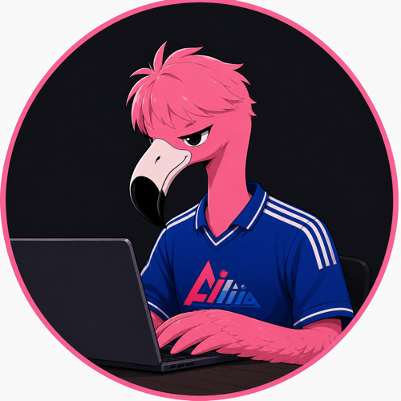

# Hi, I'm Flaming! 🦩

  

  <strong>Founder of <a href="https://ai-ing.org">ai-ing.org</a></strong>

  <i>"Ship Fast, Learn Faster."</i> 
  <i>"Don't think, Just Code."</i>

---

### 🚀 About Me
인공지능과 실용적인 웹 기술을 융합하여 빠르고 강력한 프로덕트를 빌딩하는 **Flam-ing**입니다. 
생각에 갇히기보다 코드로 실행하고 빠르게 배우는 해킹(Hacking) 문화를 지향합니다.

* 🛠️ **Main Focus**: AI Agents Development, Web App Engineering & Integrations
* ⚡ **Core Philosophy**: Agile building, pragmatism, and shipping products that wow.

---

### 📊 GitHub Statistics

  
  

---

### 🔗 Connect
* **Website**: [ai-ing.org](https://ai-ing.org)
* **Email**: kmw4564@g.skku.edu
